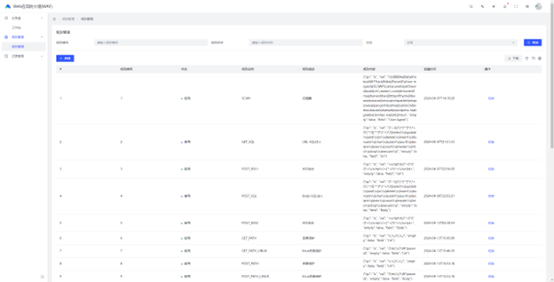

# GoWAF - Go-Powered Web Application Firewall (WAF)

**Visit GitHub for more details: [GoWAF CheckEG](https://github.com/hz157/gowaf_eg).**

---

  
  

---

## Technology Stack
This project utilizes the following technologies:
- **Vue.js**: Implemented using [Arco Design Pro](https://pro.arco.design/), an enterprise-level design system based on Vue.js.

- **Python**: High-performance API services are built using [FastAPI](https://fastapi.tiangolo.com/).

- **MySQL 8**: A high-performance relational database management system.
- **Redis**: High-speed memory storage used for caching.

## Interface Display
Below are screenshots of various interfaces within the application:
1. **Login Interface**  
   

2. **Dashboard Interface**  
   

3. **Management Interface**  
   
